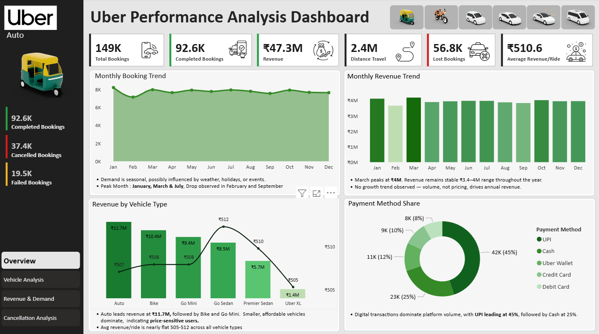
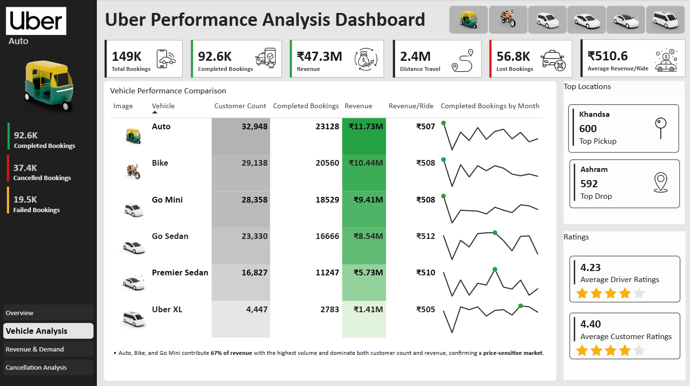
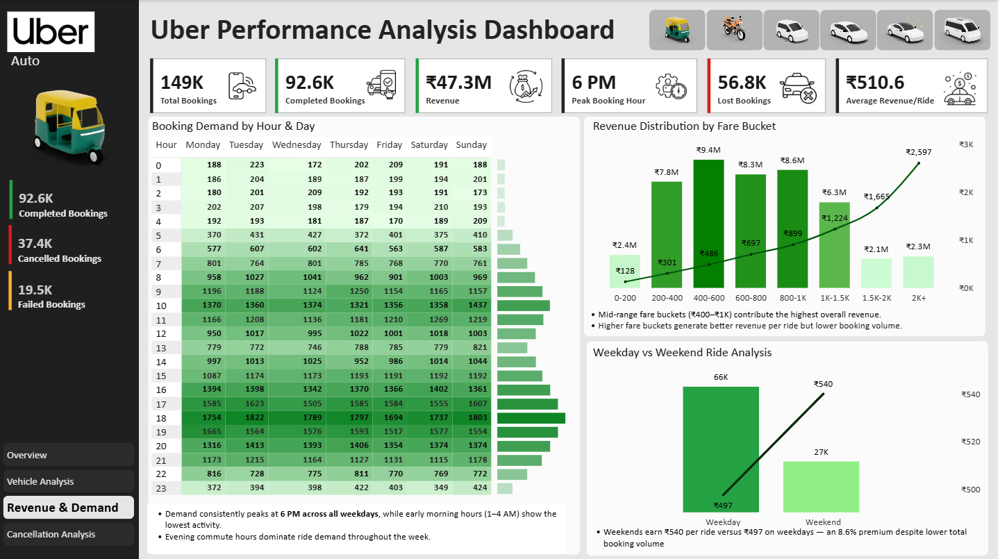
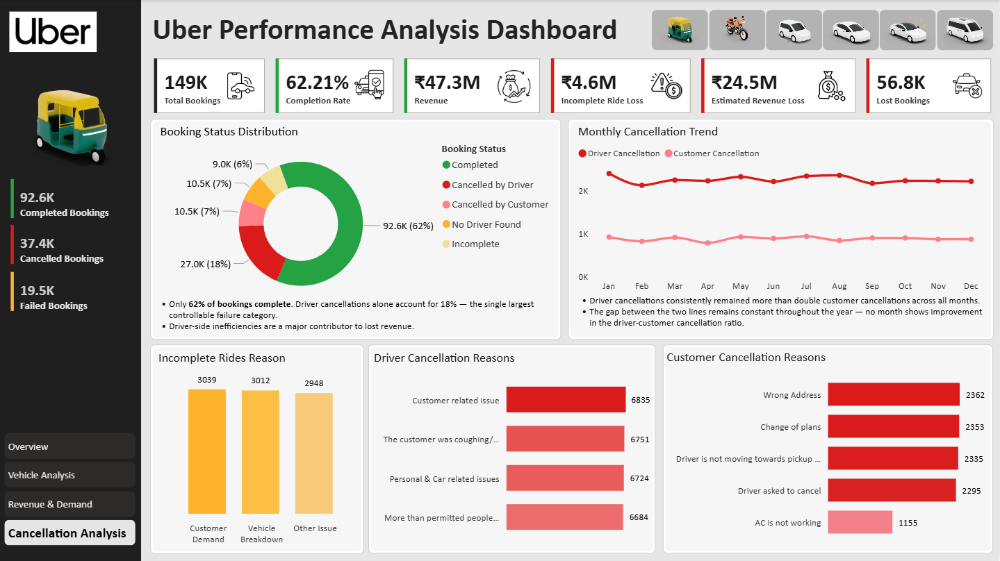

# 🚗 Uber Performance Analysis Dashboard - 2025
An interactive Power BI dashboard analyzing the operational and financial performance of Uber ridesharing services across Delhi for the year 2025.

# 📌 Project Overview
This project analyzes Uber ride-booking operations in Delhi for the year 2025 using Power BI. The dashboard transforms raw ride-booking data into meaningful business insights to help understand operational performance, customer demand, revenue trends, vehicle utilization and ride cancellations.

The project focuses on identifying key business problems such as booking failures, high cancellation rates, uneven demand distribution and revenue leakage.

# 🎯 Objective
The objective of this project is to design and develop an interactive Power BI dashboard to analyze Uber Delhi’s operational and financial performance.
The dashboard helps in:
- Monitoring platform performance through KPIs such as bookings, revenue, completion rate, and losses
- Analyzing booking and revenue trends across months, days, and hours
- Evaluating vehicle category performance and revenue contribution
- Investigating booking failures, cancellations, and incomplete rides
- Identifying opportunities to improve operational efficiency and revenue growth
- Supporting data-driven decision-making across pricing, fleet and driver management

# 🛠 Tools Used
Power BI Desktop · DAX · Data Modeling · Data Visualization

# 🔢 Key Metrics (KPIs)
- Total Bookings : 149K
- Completed Bookings : 92.6K (62.2%)
- Lost Bookings : 56.8K
- Total Revenue : ₹47.3M
- Average Revenue per Ride : ₹510.6
- Distance Travelled : 2.4M km
- Peak Hour : 6PM
- Estimated Annual Revenue Loss : ₹29.1M

  # 💡 Key Insights
- Demand peaks in **January, March, and July**, while February and September consistently show lower bookings.
- **6 PM** is the peak booking hour across all days of the week.
- Weekdays generate higher booking volume, while weekends generate higher revenue per ride.
- **Auto, Bike, and Go Mini** contribute **67%** of total revenue, indicating a price-sensitive customer base.
- Average revenue per ride is nearly identical across all vehicles **(₹505–₹512)** — growth is driven by volume, not pricing
- Revenue growth is driven by **booking volume** rather than pricing differences.
- Driver cancellations are more than double customer cancellations and remained **consistently high** throughout the year.
- The platform experienced an estimated **₹29.1M annual revenue loss** from cancellations and incomplete rides.

# ✅ Recommendations
- Introduce surge pricing and driver incentives during peak demand hours (5–7 PM).
- Run targeted promotions during low-demand months such as February and September.
- Expand focus on affordable vehicle categories like Auto, Bike, and Go Mini.
- Improve driver accountability and ride allocation systems to reduce cancellations.
- Promote digital payments through cashback offers and loyalty rewards.
- Use weekend-focused pricing strategies to maximize higher per-ride revenue.

# 📷 Dashboard Preview
## Dashboard Screenshots

## Dashboard Demo

# 🛠️ How to Use
- Clone this repository
- Open Dashboard/Uber_Performance_Analysis_Dashboard.pbit in Power BI Desktop
- The dashboard is pre-loaded with the dataset — no additional setup required
- Use the vehicle filter icons at the top to slice data by vehicle type
- Navigate between pages using the left sidebar: Overview → Vehicle Analysis → Revenue & Demand → Cancellation Analysis

# 👤 Author
- **Kanupriya Rawat**  
- 📧 kanupriyarawat04@gmail.com
- 🔗 [LinkedIn](https://www.linkedin.com/in/kanupriyarawat)
- 💻 [GitHub](https://github.com/kanupriya-rawat)  

